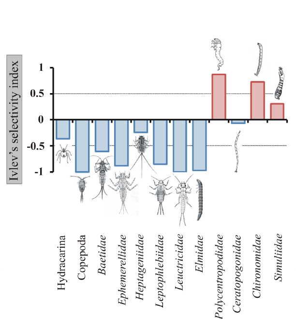

```{r setup, include=FALSE}
knitr::opts_chunk$set(echo = TRUE)
```

```{r, include=FALSE}
library(readr)
library(tidyverse)
library(ggplot2)
library(dplyr)
library(knitr)
library(gt)
library(car)
library(gridExtra)
library(multcompView)


cliona <- read_csv("../Cliona.csv") #load data
```

# *Spencer Parr Thesis Analysis* {.tabset}

## Info

**Study Overview**:\
The primary objective of this study is to assess the impact of Clionid sponges on coral reef ecosystems in the U.S. Virgin Islands. Coral reefs are critical for biodiversity and marine life, but have faced significant declines due to environmental stressors, including climate change, ocean acidification, and disease outbreaks. Clionid sponges, as bioeroders, contribute to coral degradation by breaking down the calcium carbonate structure of corals, accelerating reef decline. By examining the prevalence and interactions of Cliona sponges with coral over time, this research aims to understand how these sponges influence reef health and resilience, particularly in response to environmental disturbances such as bleaching events and hurricanes.

This study utilizes long-term data collected by the Territorial Coral Reef Monitoring Program (TCRMP) from 2009 to 2023 across 34 reef sites in the USVI. The research focuses on three main questions: (1) how Cliona cover and coral interactions have changed over time, (2) how shifts in coral abundance affect Cliona-coral interactions, and (3) whether Cliona presence correlates with coral health, particularly disease prevalence. Through statistical modeling, including generalized linear models (GLMs) and linear mixed-effects models (LMEMs), the study will analyze the relationship between Cliona prevalence and environmental variables such as temperature, water quality, and coral species. This analysis is intended to reveal patterns of Cliona recruitment on stressed or diseased corals and to identify species-specific vulnerabilities, providing insights into the adaptive mechanisms of Cliona and guiding reef conservation strategies in light of changing ocean conditions.

**Code Explanation**:\
The R scripts provided manage and manipulate TCRMP data, preparing it for statistical analysis. Key steps include filtering Cliona species data, calculating prevalence, and integrating environmental factors. Models such as Linear Mixed-Effects Models (LMEMs) and Generalized Linear Models (GLMs) are applied to assess Cliona recruitment patterns, coral interactions, and environmental influences.

Spencer Parr

## Metadata

**Coral Health Data**:\
Coral health data is the base structure of the the TCRMP data collection.

## Cliona Prevalence- Coral Health Data

### *This code explains the data management/manipulation and graphical evidence Cliona prevalence for each TCRMP location*

1.  The data is read into R using `read_csv`, and then selected columns are extracted, specifically: `Period`, `SampleType`, `Location`, `SampleYear`, `Method`, `Transect`, `SPP`, `Cliona`, `Spo1`, `Spo1ID`, `Spo2ID`, and `Spo2`. This selection reduces the dataset to only the columns relevant to this analysis.

2.  Next, a new column called `presence` is created to indicate whether there is evidence of *Cliona* presence on each sample. The `mutate` function is used along with `if_else` to assign a value of `1` to `presence` if any of the following conditions are met: the `Cliona` value is greater than zero, `Spo1ID` or `Spo2ID` columns contain either "CLSP" or "BOSP". If none of these conditions are met, `presence` is set to `0`. After this, `presence` values are checked for any missing data, and `replace_na` is used to fill any `NA` values with `0`, ensuring that `presence` is either `1` or `0` without any missing values.

3.  The code then applies several filters to refine the dataset. First, it filters for rows where `Period` is either "Annual" or "PostBL", `SampleType` is either "Permanent" or "permanent", and `Method` is either "intercept" or "50 cm belt". This step ensures that only specific types of samples are kept for the analysis. Further, rows where `Transect` contains the letter "A" are removed, ensuring that only certain transect data is included. Finally, the code filters for rows where `SampleYear` is 2005 or later, focusing on more recent data.

4.  In the last step, additional transformations are applied. A new `ID` column is created to provide a unique identifier for each row, generated as a sequence from `1` to the number of rows in the filtered dataset. The `SampleYear`, `Location`, and `Transect` columns are converted to factor data types using `as.factor` to prepare them for categorical analysis. This finalizes the dataset with all necessary transformations, making it ready for further analysis or modeling.

```{r,warning = FALSE, message = FALSE}
#1
cliona <- read_csv("../Cliona.csv")%>%
  select(Period,SampleType, Location, SampleYear, Method, Transect, SPP, Cliona, Spo1, Spo1ID, Spo2ID, Spo2)%>%
  #2
  mutate(presence=if_else(Cliona>0 | Spo1ID %in% c("CLSP", "BOSP") | Spo2ID %in% c("CLSP", "BOSP"),1,0))%>%
  mutate(presence=replace_na(presence,0))%>%
  #3
  filter(Period%in% c("Annual","PostBL")&SampleType%in% c("Permanent","permanent")&Method%in% c("intercept","50 cm belt"))%>%
  filter(!grepl("A",Transect))%>%
  filter(SampleYear>=2005)%>%
  #4
  mutate(ID=1:nrow(.),
         SampleYear=as.factor(SampleYear),
         Location=as.factor(Location),
         Transect=as.factor(Transect))
```

5.  This R code calculates Cliona sponge prevalence across transects by grouping the `cliona` dataset by `Location`, `SampleYear`, and `Transect`. Within each group, it calculates three metrics: `prev` (the average presence of Cliona, indicating prevalence), `freq` (total occurrences of Cliona), and `total` (total observations in that group). After ungrouping the data, it adds a unique `ID` to each row. The resulting `transectprev` dataset provides summarized prevalence data for each unique combination of location, year, and transect.

```{r,warning = FALSE, message = FALSE}
transectprev <- cliona %>%
  group_by(Location, SampleYear, Transect) %>%
  summarise(prev = mean(presence), freq = sum(presence), total = n())%>%
  ungroup()%>%
  mutate(ID= 1:nrow(.))
```

6.  This code creates a summary data frame, `location_means`, showing the average *Cliona* sponge prevalence for each location. It groups the `transectprev` data by `Location` and then calculates the mean of `prev` (prevalence) within each group, saving the result as `mean_prev`. The resulting `location_means` data frame has each location’s name and its corresponding average *Cliona* prevalence.

```{r, warning = FALSE, message = FALSE}
location_means <- transectprev %>%
  group_by(Location) %>%
  summarise(mean_prev = mean(prev))
```

7.  This code generates a plot that visualizes the prevalence of *Cliona* sponges at different reef sites by creating a boxplot for each location. The `ggplot` function uses the `transectprev` dataset, which contains *Cliona* prevalence data, and arranges the locations on the x-axis in descending order of prevalence. Each boxplot represents the range and distribution of *Cliona* prevalence values at that location. To enhance the visualization, the code includes a `stat_summary` layer that adds a green diamond marker at the mean prevalence for each location, making it easy to compare average *Cliona* prevalence across sites.

    ```{r}
    ggplot(transectprev, aes(x = reorder(Location, -prev), y = prev)) +
      geom_boxplot(fill = "lightblue") +
      stat_summary(fun = mean, geom = "point", shape = 18, size = 3, color = "darkgreen") +
      labs(title = "Prevalence of Cliona Sponges by Location (with Mean Prevalence Marked)",
           x = "Location",
           y = "Prevalence") +
      theme_minimal() +
      theme(axis.text.x = element_text(angle = 45, hjust = 1))
    ```

This plot is important because it reveals the variability in *Cliona* prevalence across different reef sites. Locations such as Salt River West, Brewers Bay, and Savana show significantly higher prevalence levels, as indicated by both the wider range and higher position of the boxplots and mean markers, compared to other sites with much lower prevalence. This variability suggests that certain sites may be more susceptible to *Cliona* sponge colonization, potentially due to environmental conditions or other factors specific to those areas.

8.  This code produces a set of line graphs showing the prevalence of Cliona sponges over time, broken down by transect and location. Each location has its own panel (using facet_wrap), and within each panel, different transects are represented by distinct lines and colors. The x-axis represents the sample year, while the y-axis shows the prevalence of Cliona sponges. The lines connect the prevalence data points over time for each transect, while points mark each specific measurement. The scale_x_continuous function formats the x-axis labels to show each unique year in the dataset, improving clarity.

```{r, fig.width=15, fig.height=8}
# Convert SampleYear to numeric, if appropriate
transectprev$SampleYear <- as.numeric(transectprev$SampleYear)

# Then plot with the updated variable
ggplot(transectprev, aes(x = SampleYear, y = prev, color = factor(Transect), group = Transect)) +
  geom_line() +
  geom_point() +
  facet_wrap(~Location, scales = "free_y") +
  labs(title = "Prevalence Over Years by Transect",
       x = "Year",
       y = "Prevalence",
       color = "Transect") +
  scale_x_continuous(breaks = unique(transectprev$SampleYear), labels = unique(transectprev$SampleYear)) +
  theme_minimal() +
  theme(axis.text.x = element_text(angle = 45, hjust = 1),
        plot.title = element_text(hjust = 0.5))
```

This graph is valuable because it allows for temporal analysis of Cliona prevalence trends at multiple scales: across years, transects, and locations. By categegorising between the data by transect and location, the plot can reveal patterns, such as consistent increases or decreases in prevalence, or fluctuations in response to specific events or environmental changes. It could also be used to identify which transects or locations show higher susceptibility to Cliona over time.

Spencer Parr

## Cliona Prevalence by Reef Complex

### *This code shows the process of cleaning, graphing, and analyzing the coral health data in order to find if there is any significant difference in Cliona prevalence between Nearshore, Offshore, and Mesophotic sites.* 

1.  revert back to Coral Prevalence- Coral Health Data tab, steps 1-5 are identical

    ```{r, warning = FALSE, message = FALSE}
    #1
    cliona <- read_csv("../Cliona.csv")%>%
      select(Period,SampleType, Location, SampleYear, Method, Transect, SPP, Cliona, Spo1, Spo1ID, Spo2ID, Spo2)%>%
      #2
      mutate(presence=if_else(Cliona>0 | Spo1ID %in% c("CLSP", "BOSP") | Spo2ID %in% c("CLSP", "BOSP"),1,0))%>%
      mutate(presence=replace_na(presence,0))%>%
      #3
      filter(Period%in% c("Annual","PostBL")&SampleType%in% c("Permanent","permanent")&Method%in% c("intercept","50 cm belt"))%>%
      filter(!grepl("A",Transect))%>%
      filter(SampleYear>=2005)%>%
      #4
      mutate(ID=1:nrow(.),
             SampleYear=as.factor(SampleYear),
             Location=as.factor(Location),
             Transect=as.factor(Transect))
    #5
    transectprev <- cliona %>%
      group_by(Location, SampleYear, Transect) %>%
      summarise(prev = mean(presence), freq = sum(presence), total = n())%>%
      ungroup()%>%
      mutate(ID= 1:nrow(.))
    ```

2.  Read in the TCRMP site metadata csv. This data frame has 8 columns: Location (e.g., Coral Bay), Code (e.g., CRB), Island (e.g., STJ), Latitude (e.g., 18.338), Longitude (e.g., -64.704), ReefComplex (e.g., Nearshore), Depth (e.g., 9), and YearAdded (e.g., 2011)

    ```{r,  warning = FALSE, message = FALSE}
    reef_complex <- read_csv("../SiteMetadata.csv")
    ```

3.  Next I merge the **`transectprev`** data frame with the **`reef_complex`** data frame, adding reef complex information (e.g., Nearshore, Offshore, Mesophotic) to the corresponding locations in **`transectprev`** based on the **`Location`** column.

    ```{r,  warning = FALSE, message = FALSE}
    Reef_Types <- transectprev %>%
      left_join(reef_complex, by = "Location")
    ```

4.  This code groups the **`Reef_Types`** data frame by **`Location`** and **`ReefComplex`**, calculates the mean prevalence (**`prev`**) for each group while ignoring missing values, and then converts **`ReefComplex`** into a factor with the levels ordered as **"Nearshore," "Offshore,"** and **"Mesophotic."**

    ```{r, warning = FALSE, message = FALSE}
    reef_sum <- Reef_Types %>%
      group_by(Location, ReefComplex) %>%
      summarise(
        mean_prevalence = mean(prev, na.rm = TRUE)  # Calculate mean prevalence
      )%>%
      mutate( ReefComplex = factor(ReefComplex, levels = c("Nearshore", "Offshore", "Mesophotic")))
    ```

5.  This code generates a boxplot to visualize the mean prevalence of Cliona sponges across different reef complexes using the `reef_sum` dataset. It maps `ReefComplex` to the x-axis, `mean_prevalence` to the y-axis, and uses colors to distinguish reef complexes.

    ```{r, fig.width=15, fig.height=8}
    ggplot(reef_sum, aes(x = ReefComplex, y = mean_prevalence, fill = ReefComplex)) +
      geom_boxplot(outlier.color = "red", outlier.shape = 16) +
      geom_jitter(width = 0.2, size = 2, alpha = 0.6) +  # Add jitter for data points
      labs(
        title = "Cliona Sponge Prevalence Across Reef Complexes",
        x = "Reef Complex",
        y = "Mean Prevalence"
      ) +
      theme_minimal() +
      theme(
        legend.position = "none",
        axis.text.x = element_text(angle = 45, hjust = 1)
      )
    ```

6.  Next we run a one-way Analysis of Variance (ANOVA) to test whether there is a statistically significant difference in **mean Cliona sponge prevalence** across different **ReefComplex** categories (Nearshore, Offshore, and Mesophotic).

    ```{r,warning = FALSE, message = FALSE}
    # Run ANOVA
    anova_result <- aov(mean_prevalence ~ ReefComplex, data = reef_sum)
    ```

    The ANOVA results indicate a statistically significant difference in the mean prevalence of **Cliona sponge coverage** across the three reef complexes (Nearshore, Offshore, and Mesophotic). The **ReefComplex** factor accounts for a **Sum of Squares (Sum Sq)** of **0.005884**, while the residual variation (unexplained variance) accounts for **0.013323**. The **Mean Square (Mean Sq)** for ReefComplex is **0.0029420**, and the F-statistic is **6.625**, with an associated p-value (**Pr(\>F)**) of **0.00414**. This p-value is below the conventional threshold of 0.05, suggesting that the differences in Cliona prevalence among the reef complexes are statistically significant.

    ```{r}

    # Create a ANOVA table
    broom::tidy(anova_result) %>%
      gt() %>%
      tab_header(
        title = "ANOVA Results for Cliona Sponge Prevalence Across Reef Complexes"
      )

    ```

7.  Next step is the **TukeyHSD (Tukey's Honest Significant Differences)** test which is a post-hoc analysis used to identify which specific group pairs have significant differences in their means. It adjusts for multiple comparisons to control the family-wise error rate, ensuring that conclusions about group differences are not overstated.

    ```{r,warning = FALSE, message = FALSE}
    tukey_result <- TukeyHSD(anova_result)
    ```

    The TukeyHSD test shows a significant difference in Cliona sponge prevalence between Nearshore and Mesophotic reefs, with Nearshore having a higher mean prevalence (difference = **0.0331**, p = **0.003**). No significant differences were found between Offshore and Mesophotic reefs (p = **0.207**) or Offshore and Nearshore reefs (p = **0.151**). These results indicate that Nearshore reefs have notably higher prevalence compared to Mesophotic reefs, while other comparisons show no meaningful differences.

    ```{r}

    # Create a TukeyHSD table
    broom::tidy(tukey_result) %>%
      gt() %>%
      tab_header(
        title = "TukeyHSD Results for Cliona Sponge Prevalence Across Reef Complexes"
      )
    ```

    We still need to check for normality of residuals and homogeneity of variances. For normality a Shapiro-Wilk statistic will be ran, and for homogeneity of variances an Levene's test will be ran.

8.  The Shapiro-Wilk test produced a **W statistic of 0.965** and a **p-value of 0.3555**. Since the p-value is greater than the conventional threshold of 0.05, we fail to reject the null hypothesis that the residuals are normally distributed. This indicates that the assumption of normality for the ANOVA model's residuals is satisfied, supporting the validity of the ANOVA results.

    ```{r}
    shapiro<-shapiro.test(residuals(anova_result))

    # Create a shapiro table
    broom::tidy(shapiro) %>%
      gt() %>%
      tab_header(
        title = "Shapiro-Wilk Results for Cliona Sponge Prevalence Across Reef Complexes"
      )
    ```

9.  The **Q-Q plot** shows that the residuals align closely with the red reference line, indicating that they are approximately normally distributed. The **histogram** demonstrates that the residuals are symmetrically distributed around zero. And the **density plot** compares the residuals’ distribution (blue line) to a theoretical normal curve (red dashed line), showing strong alignment with minor deviations. These plots confirm that the residuals satisfy the normality assumption required for ANOVA, supporting the validity of the statistical analysis.

    ```{r, fig.width=15, fig.height=8}

    # Generate individual plots
    qq_plot <- ggplot(data.frame(residuals = residuals(anova_result)), aes(sample = residuals)) +
      stat_qq() + stat_qq_line(color = "red") + 
      labs(title = "Q-Q Plot of Residuals")

    hist_plot <- ggplot(data.frame(residuals = residuals(anova_result)), aes(x = residuals)) +
      geom_histogram(binwidth = 0.005, fill = "lightblue", color = "black") + 
      labs(title = "Histogram of Residuals", x = "Residuals", y = "Frequency") +
      theme_minimal()

    density_plot <- ggplot(data.frame(residuals = residuals(anova_result)), aes(x = residuals)) +
      geom_density(color = "blue", fill = "lightblue", alpha = 0.5) +
      stat_function(fun = dnorm, args = list(mean = mean(residuals(anova_result)), 
                                             sd = sd(residuals(anova_result))),
                    color = "red", linetype = "dashed") +
      labs(title = "Density Plot with Normal Curve", x = "Residuals", y = "Density")

    # Arrange plots
    grid.arrange(qq_plot, hist_plot, density_plot, nrow = 1)

    ```

10. The Levene's test results show an **F-value of 2.3661** with a **p-value of 0.1111**. Since the p-value is greater than the threshold of 0.05, we fail to reject the null hypothesis that the group variances are equal. This indicates that the assumption of homogeneity of variance is satisfied, supporting the appropriateness of using ANOVA for this data.

    ```{r}
    levene<-leveneTest(mean_prevalence ~ ReefComplex, data = reef_sum)

    # Create a Levene table
    broom::tidy(levene) %>%
      gt() %>%
      tab_header(
        title = "Levene's Test Results for Cliona Sponge Prevalence Across Reef Complexes"
      )
    ```

11. Finally, we need to visualize the original mean prevalence between reef complexes but now with TukeyHSD multcompletters. First, the **`TukeyHSD`** function is applied to the ANOVA model to compute pairwise comparisons of means for the "ReefComplex" variable, identifying which groups differ significantly. The **`multcompView::multcompLetters`** function then assigns grouping letters (e.g., "a", "b") based on adjusted p-values, indicating which groups are statistically similar or different. These labels are converted into a data frame, with the "ReefComplex" levels and their respective group letters for easy handling. Finally, the **`left_join`** function integrates the Tukey test results (group letters) into the **`reef_sum`** dataset.

    ```{r, warning = FALSE, message = FALSE}
    ####visualise the resutls#######

    # Extract Tukey test results
    tukey_result <- TukeyHSD(anova_result, "ReefComplex")

    # Convert Tukey results to group letters
    library(multcompView)
    tukey_labels <- multcompLetters(tukey_result$ReefComplex[, "p adj"])$Letters

    # Convert to a data frame for merging
    tukey_labels <- data.frame(
      ReefComplex = names(tukey_labels),
      group = tukey_labels
    )

    # Merge tukey_labels with your reef_sum data
    reef_sum <- reef_sum %>%
      left_join(tukey_labels, by = "ReefComplex")

    ```

12. This code generates a boxplot comparing mean Cliona sponge prevalence across three reef complexes: Mesophotic, Nearshore, and Offshore, with statistical group labels from Tukey's post-hoc test. The boxplot shows the median prevalence (horizontal line), spread (interquartile range and whiskers), and outliers (red dots). Statistical group labels ("a", "b", "ab") indicate significant differences: Mesophotic reefs have significantly lower prevalence than Nearshore (p = 0.003), while Offshore overlaps with both. Nearshore reefs have the highest prevalence and variability, Mesophotic the lowest with narrow spread, and Offshore shows intermediate prevalence. This visualization highlights depth-related differences in sponge prevalence, suggesting ecological patterns tied to reef complex characteristics.

    ```{r, fig.width=15, fig.height=8}
    # Plot with Tukey labels
    ggplot(reef_sum, aes(x = ReefComplex, y = mean_prevalence, fill = ReefComplex)) +
      geom_boxplot(outlier.color = "red", outlier.shape = 16) +
      geom_jitter(width = 0.2, size = 2, alpha = 0.6) +
      geom_text(
        aes(label = group, x = ReefComplex, y = max(mean_prevalence) + 0.01),
        data = reef_sum, inherit.aes = FALSE, color = "black", size = 4, vjust = -0.5
      ) +
      labs(
        title = "Cliona Sponge Prevalence Across Reef Complexes",
        x = "Reef Complex",
        y = "Mean Prevalence"
      ) +
      theme_minimal() +
      theme(
        legend.position = "none",
        axis.text.x = element_text(angle = 45, hjust = 1)
      )

    ```

## Cliona Extent

### *This code explains the data management/manipulation and graphical evidence Cliona extent for each TCRMP location*

1.  The data is read into R using `read_csv`, and then selected columns are extracted, specifically: `Period`, `SampleType`, `Location`, `SampleYear`, `Method`, `Transect`, `SPP`, `Cliona`, `Spo1`, `Spo1ID`, `Spo2ID`, and `Spo2`. This selection reduces the dataset to only the columns relevant to this analysis.

2.  the code generates two new columns, `CLSP` and `BOSP`, which indicate coverage values for two types of sponges. Using the `mutate` and `case_when` functions, it examines the columns `Spo1ID` and `Spo2ID` to populate these new columns. If `Spo1ID` contains "CLSP", then the value of `Spo1` is assigned to the `CLSP` column. Similarly, if `Spo2ID` contains "CLSP", then the value from `Spo2` is assigned to `CLSP`. The same process is used to populate the `BOSP` column, using "BOSP" as the indicator. If neither condition is met in either case, the value is set to `NA.`

3.  The code then filters the data based on several criteria. First, it keeps only rows where `Period` is either "Annual" or "PostBL" and `SampleType` is either "Permanent" or "permanent", ensuring consistency in sample type naming. Also, only rows where `Method` is either "intercept" or "50 cm belt" are retained, narrowing the dataset to specific sampling methods. And rows with certain letters in the `Transect` column ("A", "R", or "L") are excluded using a filtering condition with `grepl`, and only data from 2005 onward (`SampleYear >= 2005`) is kept.

4.  Finally, the data is reshaped from a wide format to a long format using `pivot_longer`. This transformation takes the columns `CLSP`, `BOSP`, and `Cliona` and combines them into two new columns: `SpongeType` and `Extent`. The `SpongeType` column identifies which type of sponge coverage is being recorded (either `CLSP`, `BOSP`, or `Cliona`), and `Extent` contains the corresponding value of coverage for each type.

```{r, warning = FALSE, message = FALSE}

#1. 
clionaext <- read_csv("../Cliona.csv")%>%
  select(Period,SampleType, Location, SampleYear, Method, Transect, SPP, Cliona, Spo1, Spo1ID, Spo2ID, Spo2)%>%
  
#2.
  mutate( CLSP = case_when( Spo1ID == "CLSP" ~ Spo1, Spo2ID == "CLSP" ~ Spo2, TRUE ~ NA_real_),
    BOSP = case_when( Spo1ID == "BOSP" ~ Spo1, Spo2ID == "BOSP" ~ Spo2,
      TRUE ~ NA_real_)) %>%
  select(-Spo1, -Spo1ID, -Spo2, -Spo2ID)%>%
  
#3.
  filter(Period%in% c("Annual","PostBL")&SampleType%in% c("Permanent","permanent")&Method%in% c("intercept","50 cm belt"))%>%
  filter(!grepl("A", "R", "L",Transect))%>%
  filter(SampleYear>=2005)%>%
  mutate(ID=1:nrow(.),
         SampleYear=as.factor(SampleYear),
         Location=as.factor(Location),
         Transect=as.factor(Transect))%>%
  
#4. 
  pivot_longer(cols = c(CLSP, BOSP, Cliona), 
               names_to = "SpongeType", 
               values_to = "Extent")

```

For the first analysis, I ask the question: Has the extent of Cliona sponge coverage increased or decreased over time? Is there a pattern in prevalence by year?

5.  This code assigns the `clionaext` data frame to a new data frame named `ext_time`. It then updates `ext_time` by converting the `SampleYear` column from a factor to a numeric data type, ensuring that the year values are treated as continuous numbers rather than categorical labels.

    ```{r, warning = FALSE, message = FALSE}
    ext_time<-clionaext

    ext_time <- ext_time %>%
      mutate(SampleYear = as.numeric(as.character(SampleYear)))
    ```

6.  This code processes the `clionaext` data frame to calculate the total number of unique corals recorded in each year. First, it groups the data by `SampleYear` and uses `n_distinct(ID)` to count distinct `ID` values, representing unique coral observations. The resulting data frame, `unique_coral_counts`, contains `SampleYear` and `total_unique_corals`.

    Next, the `SampleYear` column is converted from a factor to numeric using `mutate`. This ensures the year values are treated as continuous numbers for analyses or visualizations that require numerical formatting.

```{r, warning = FALSE, message = FALSE}

unique_coral_counts <- clionaext %>%
  group_by(SampleYear) %>%
  summarise(total_unique_corals = n_distinct(ID)) 

unique_coral_counts <- unique_coral_counts%>%
  mutate(SampleYear = as.numeric(as.character(SampleYear)))
```

7.  This code creates a new data frame, `ext_time_with_counts`, by merging (`left_join`) the `ext_time` data frame with the `unique_coral_counts` data frame. The join is performed using the `SampleYear` column, which is common to both data frames.

```{r, warning = FALSE, message = FALSE}

ext_time_with_counts <- ext_time %>%
  left_join(unique_coral_counts, by = "SampleYear")
```

8.  This code processes the `ext_time_with_counts` data frame to summarize sponge coverage by year. It groups the data by `SampleYear` and calculates the total extent of sponge coverage (`total_extent`), retrieves the total unique coral count for each year (`count_observations`), and computes the weighted average extent (`weighted_avg_extent`) by dividing the total extent by the unique coral count.

```{r, warning = FALSE, message = FALSE}

weighted_summary <- ext_time_with_counts %>%
  group_by(SampleYear) %>%
  summarise(
    total_extent = sum(Extent, na.rm = TRUE),
    count_observations = first(total_unique_corals),  # Use `first` to avoid altering the count
    weighted_avg_extent = total_extent / count_observations
  )
```

9.  This code creates a line plot using the `weighted_summary` data frame to visualize the weighted average extent of Cliona sponge coverage over time. It maps `SampleYear` to the x-axis and `weighted_avg_extent` to the y-axis, adding a blue line and points to highlight the data, along with a minimal theme and descriptive labels for the title, x-axis, and y-axis.

```{r, fig.width=15, fig.height=8}
ggplot(weighted_summary, aes(x = SampleYear, y = weighted_avg_extent)) +
  geom_line(color = "blue") +
  geom_point(size = 2) +
  labs(
    title = "Weighted Average Cliona Sponge Coverage Over Time",
    x = "Year",
    y = "Weighted Average Extent of Coverage"
  ) +
  theme_minimal()

```

Next I ask the question: How does the extent of coverage differ between coral species each year? Are there species that experience fluctuating or consistent coverage levels over time?

10. This code creates a summary data frame, `spp_summary`, by grouping the `ext_time_with_counts` data frame by `SampleYear` and `SPP` (coral species). For each group, it calculates the total sponge coverage extent (`total_extent`), retrieves the total unique coral count for the year (`count_observations`), and computes the weighted average sponge extent (`weighted_avg_extent`) by dividing the total extent by the unique coral count. This provides a standardized metric of sponge coverage for each coral species across years.

```{r, warning = FALSE, message = FALSE}

spp_summary <- ext_time_with_counts %>%
  group_by(SampleYear, SPP) %>%
  summarise(
    total_extent = sum(Extent, na.rm = TRUE),
    count_observations = first(total_unique_corals),
    weighted_avg_extent = total_extent / count_observations
  )
```

11. This code creates a line plot using the `spp_summary` data frame to visualize the weighted average extent of Cliona sponge coverage over time for each coral species (`SPP`). The x-axis represents `SampleYear`, the y-axis represents `weighted_avg_extent`, and different coral species are distinguished by color.

```{r, fig.width=15, fig.height=8}

ggplot(spp_summary, aes(x = SampleYear, y = weighted_avg_extent, color = SPP)) +
  geom_line() +
  geom_point() +
  labs(
    title = "Weighted Average Cliona Sponge Coverage by Coral Species Over Time",
    x = "Year",
    y = "Weighted Average Extent of Coverage"
  ) +
  theme_minimal()
```

Spencer Parr

## Substrate Preference

### Ivlev's Electivity Index

The **Ivlev's Electivity Index** (Ei) is a quantitative measure used to determine an organism's preference for certain food or habitat types relative to their availability. In this thesis, it is applied to assess the *Cliona delitrix* sponge's substrate preferences on coral reefs. Specifically, the index compares the proportion of coral species colonized by Cliona to the proportion of those species available in the environment. A positive Ei value indicates a preference, while negative values suggest avoidance. This helps in understanding how Cliona sponges select coral species under different environmental conditions.

Electivity indices measure the utilization of food types (r) in relation to their abundance or availability in the environment (p). Foods that constitute a larger proportion of the diet than of the available foods are considered preferred; conversely those proportionately underrepresented in the diet are avoided.

[](https://www.researchgate.net/publication/235437330_InTech-Ontogenetic_dietary_shifts)

While **Ivlev's Electivity Index** is typically used for dietary preferences, it can still be effectively applied to *Cliona delitrix* sponges in this thesis, despite corals not being a food source. Cliona sponges exhibit substrate preferences for certain coral species based on factors such as calcium carbonate concentration. Some stony corals have denser calcium carbonate skeletons, which may be harder for Cliona to excavate and colonize. Thus, the sponge's choice is driven by its ability to grow and obtain necessary nutrients, similar to dietary selectivity in food webs.

1.  **Coral Abundance by Species and Location**:

-   The code first calculates how many times each coral species appears at each location (site). This gives a general sense of coral distribution across different locations, providing a simple count of occurrences per species at each site.

2.  **Coral Abundance by Species, Location, Transect, and Year**:

<!-- -->

-   The second part refines the calculation to be more detailed by including both **transects** (smaller sampling areas within locations) and **sample years**. This breakdown gives the number of occurrences for each species not only by location but also by transect and year, making it possible to track coral abundance more precisely across both space and time.

```{r,warning = FALSE, message = FALSE}

# Calculate coral abundance by transect and year
coral_abundance <- cliona %>%
  group_by(SPP, Location, Transect, SampleYear) %>%
  summarise(Abundance = n()) %>%
  ungroup()

clionaclean1 <- cliona %>%
  left_join(coral_abundance, by = c("SPP", "Location", "Transect", "SampleYear"))
```

3.  **Summarizing Total Presence and Abundance**:

-   The code calculates two key metrics for each coral species (`SPP`). The code creates a summary of each coral species, providing an overall count of how often each species was present and its total abundance across the entire dataset. This allows for a better understanding of the relative presence and prevalence of different coral species in the study area.

```{r}
# Summarize data to calculate total presence and abundance of each coral species
summary_cliona <- clionaclean1 %>%
  group_by(SPP) %>%
  summarise(TotalPresence = sum(presence), 
            TotalAbundance = sum(Abundance)) %>%  # Adjust for coral abundance
  ungroup()
```

4.  

-   This code calculates the **proportions of presence and availability** for each coral species and then computes **Ivlev's Electivity Index** to determine whether species are disproportionately present relative to their availability in the environment.

```{r}
# Calculate proportions and then Ivlev's Electivity Index adjusted for coral abundance
 Ivlev_Index <- summary_cliona %>%
   mutate(ProportionPresence = TotalPresence / sum(TotalPresence),
         ProportionAvailability = TotalAbundance / sum(TotalAbundance),  # Use abundance
          IvlevIndex = (ProportionPresence - ProportionAvailability) /
            (ProportionPresence + ProportionAvailability))

Ivlev_Index %>%
  kable(caption = "Ivlev's Electivity Index Adjusted for Coral Abundance", digits = 4)
```

5.  The resulting graph shows a clear separation at zero, with bars above zero (blue) indicating a preference for certain coral species and bars below zero (red) indicating avoidance. This pattern reveals that Cliona generally avoids many coral species, with only a few species showing a positive electivity index, suggesting that Cliona selectively colonizes specific corals. This insight helps identify coral species that are more vulnerable to Cliona colonization, which is important for managing coral health and understanding Cliona’s ecological impact on reef systems.

```{r, warning = FALSE, message = FALSE, fig.width=13, fig.height=8}
ggplot(Ivlev_Index, aes(x = reorder(SPP, IvlevIndex), y = IvlevIndex, fill = IvlevIndex > 0)) +
  geom_bar(stat = "identity", width = 0.8) +
  labs(title = "Ivlev's Electivity Index for Cliona on Different Coral Species",
       x = "Coral Species",
       y = "Ivlev's Electivity Index") +
  theme_minimal(base_size = 14) +
  scale_fill_manual(values = c("red", "steelblue"), 
                    name = "Preference",
                    labels = c("Avoidance", "Preference")) +
  theme(axis.text.x = element_text(angle = 45, hjust = 1, vjust = 1, size = 10),  # Adjust angle and font size
        plot.title = element_text(hjust = 0.5, size = 16, face = "bold"),  # Center and bold title
        legend.position = "top") +  # Move legend to the top
  geom_hline(yintercept = 0, linetype = "dashed", color = "black", size = 0.5)  # Add horizontal line at 0
```

The bar graph shows Ivlev's Electivity Index for Cliona sponge prevalence on various coral species, quantifying the degree of preference (positive values) or avoidance (negative values) exhibited by Cliona. Coral species are displayed along the x-axis, with the y-axis representing the electivity index, ranging from -1 (complete avoidance) to 1 (complete preference). Most coral species show a strong avoidance by Cliona, evidenced by a majority of red bars with negative values. Notably, species such as *MFCL*, *PS*, and *DL* exhibit the highest positive electivity indices, indicating a clear preference for colonization. This suggests that these coral species may provide favorable conditions for Cliona, such as structural complexity or susceptibility to colonization. Conversely, species such as *AC*, *AF*, and *AT* demonstrate the most significant avoidance, with values near -1. This information suggests that there is selective colonization behavior of Cliona, which may have important implications for understanding its ecological interactions and impacts on coral reef ecosystems.

Spencer Parr

## Site Map


