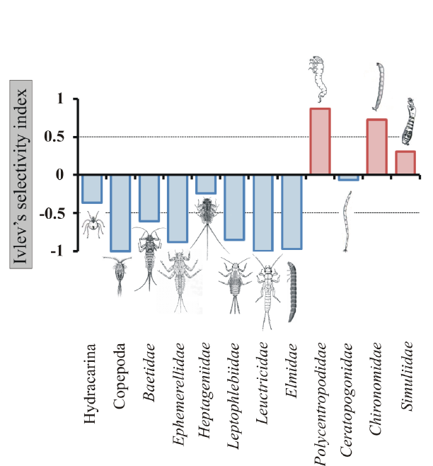

```{r setup, include=FALSE}
knitr::opts_chunk$set(echo = TRUE)
```

```{r, include=FALSE}
library(readr)
library(tidyverse)
library(ggplot2)
library(dplyr)


cliona <- read_csv("Cliona.csv") #load data
```

# *Spencer Parr Thesis Analysis* {.tabset}

## Info

**Study Overview**:\
This research investigates the impact of Cliona sponges, particularly *Cliona delitrix*, on coral reef ecosystems in the U.S. Virgin Islands (USVI). Using data from the Territorial Coral Reef Monitoring Program (TCRMP), the study spans 34 reef sites over 11 years (2012-2023), focusing on how environmental disturbances (bleaching, hurricanes, diseases) influence Cliona-coral interactions.

**Code Explanation**:\
The R scripts provided manage and manipulate TCRMP data, preparing it for statistical analysis. Key steps include filtering Cliona species data, calculating prevalence, and integrating environmental factors. Models such as Linear Mixed-Effects Models (LMEMs) and Generalized Linear Models (GLMs) are applied to assess Cliona recruitment patterns, coral interactions, and environmental influences.

## Metadata

## **Data Manipulation**

### *This code explains the data management and manipulation that was done before analysis*

1.  This code creates new columns in the cliona data frame based on whether the values in Spo1ID and Spo2ID match specific species identifiers ("CLSP" or "BOSP"). If the condition is true, it assigns the corresponding values from Spo1 and Spo2 to the new columns; otherwise, it assigns NA. This creates a more structured way to organize species-specific data from different ID columns.

```{r}
cliona <- cliona %>%
  mutate(
    CLSP = case_when(Spo1ID == "CLSP" ~ Spo1, TRUE ~ NA),  # Assign SPO1 value for CLSP
    BOSP = case_when(Spo1ID == "BOSP" ~ Spo1, TRUE ~ NA)   # Assign SPO1 value for BOSP
  )

cliona <- cliona %>%
  mutate(
    CLSP2 = case_when(Spo2ID == "CLSP" ~ Spo2, TRUE ~ NA),  # Assign SPO2 value for CLSP
    BOSP2 = case_when(Spo2ID == "BOSP" ~ Spo2, TRUE ~ NA)   # Assign SPO2 value for BOSP
  )
```

2.  Create a new data frame with only the columns that are needed

```{r}
clionaclean <- cliona[c('Location', 'SampleYear', 'Period', 'SampleType', 'Method', 'Transect', 'SPP', 'CLSP', 'BOSP', 'Cliona', 'CLSP2', 'BOSP2')]
```

3.  Finding Presence of Cliona -3A. Change Transect and Year to a Factor

```{r}
clionaclean$Transect <- as.factor(clionaclean$Transect)
clionaclean$SampleYear <- as.factor(clionaclean$SampleYear)
```

3B. Convert (CLSP, CLSP2, BOSP, BOSP2, & Cliona) columns to Binary (0 or 1)

```{r}
clionaclean$CLSP[is.na(clionaclean$CLSP)] <- 0
clionaclean$BOSP[is.na(clionaclean$BOSP)] <- 0
clionaclean$CLSP2[is.na(clionaclean$CLSP2)] <- 0
clionaclean$BOSP2[is.na(clionaclean$BOSP2)] <- 0
clionaclean$Cliona[is.na(clionaclean$Cliona)] <- 0
```

3C. Merge sponge columns together and make a new column for presence

```{r}
clionaclean$presence <- clionaclean$Cliona + clionaclean$CLSP + clionaclean$CLSP2 + clionaclean$BOSP + clionaclean$BOSP2

clionabinary <- clionaclean %>%
  mutate_if(is.numeric, ~1 * (. > 0))

clionaclean1 <- clionabinary[c('Location', 'SampleYear', 'Period', 'SampleType', 'Method', 'Transect', 'SPP', 'presence')]

clionaclean1 <- data.frame(subset(clionaclean, clionaclean$Period == 'Annual' & clionaclean$SampleType == 'Permanent' & clionaclean$Method %in% c('intercept','50 cm belt')))

```

4.  Remove transects with random letter in it and filter Year so that its from 2010-2023

```{r}
# Remove transects with "A" in the label
clionaclean1 <- clionaclean1 %>%
  filter(!grepl("A", Transect))

# Convert SampleYear from factor to numeric 
clionaclean1$SampleYear <- as.numeric(as.character(clionaclean1$SampleYear))
                                      
# Now filter rows with SampleYear >= 2010
clionaclean1 <- clionaclean1 %>%
  filter(SampleYear >= 2010)

```

## **Cliona Prevalence**

1.  Determine & Standardize: Prevalence & Frequency The first code summarizes species presence for each combination of Location, SampleYear, and Transect by calculating the mean presence (prev), total presence (freq), and the total number of observations (total). The second Code summarizes species prevalence for each year and location by calculating the average prevalence (mean_prev) for each location in each sample year.

```{r}
transectprev <- clionaclean1 %>%
  group_by(Location, SampleYear, Transect) %>%
  summarise(prev = mean(presence), freq = sum(presence), total = n())


siteprev<- transectprev %>%
  group_by(Location, SampleYear)%>%
  summarise(mean_prev=mean(prev))
```

2.  Graphing Prevalence

    -2A. Basic bar graph representing

```{r}

ggplot(siteprev, aes(x = reorder(Location, -mean_prev), y = mean_prev), color = SampleYear) +
  geom_bar(stat = "identity", fill = "black") +
  labs(title = "Prevalence of Cliona Sponges by Location",
       x = "Location",
       y = "Prevalence") +
  theme_minimal() +
  theme(axis.text.x = element_text(angle = 45, hjust = 1),
        plot.title = element_text(hjust = 0.5))

```

2B. Mean Prevalence of Cliona Sponges by Location and Year

```{r}
ggplot(transectprev, aes(x = reorder(Location, -prev), y = prev, fill = factor(SampleYear))) +
  geom_bar(stat = "identity", position = "dodge") +
  labs(title = "Mean Prevalence of Cliona Sponges by Location and Year",
       x = "Location",
       y = "Prevalence",
       fill = "Year") +
  theme_minimal() +
  theme(axis.text.x = element_text(angle = 45, hjust = 1),
        plot.title = element_text(hjust = 0.5))
```

2C. Prevalence of Cliona Sponges by Location (with Distribution)

```{r}
ggplot(transectprev, aes(x = reorder(Location, -prev), y = prev)) +
  geom_boxplot(fill = "lightblue") +
  labs(title = "Prevalence of Cliona Sponges by Location (with Distribution)",
       x = "Location",
       y = "Prevalence") +
  theme_minimal() +
  theme(axis.text.x = element_text(angle = 45, hjust = 1),
        plot.title = element_text(hjust = 0.5))
```

2D. Prevalence over years by transect

```{r}
ggplot(transectprev, aes(x = SampleYear, y = prev, color = factor(Transect), group = Transect)) +
  geom_line() +  # Draws lines between points
  geom_point() +  # Adds points for each data point
  facet_wrap(~Location, scales = "free_y") +  # Creates separate plots for each Location
  labs(title = "Prevalence Over Years by Transect",
       x = "Year",
       y = "Prevalence",
       color = "Transect") +
  scale_x_continuous(breaks = unique(transectprev$SampleYear), labels = unique(transectprev$SampleYear)) +  # Format x-axis labels
  theme_minimal() +
  theme(axis.text.x = element_text(angle = 45, hjust = 1),
        plot.title = element_text(hjust = 0.5))
```

## Substrate Preference

### Ivlev's Electivity Index

The **Ivlev's Electivity Index** (Ei) is a quantitative measure used to determine an organism's preference for certain food or habitat types relative to their availability. In this thesis, it is applied to assess the *Cliona delitrix* sponge's substrate preferences on coral reefs. Specifically, the index compares the proportion of coral species colonized by Cliona to the proportion of those species available in the environment. A positive Ei value indicates a preference, while negative values suggest avoidance. This helps in understanding how Cliona sponges select coral species under different environmental conditions.

Electivity indices measure the utilization of food types (r) in relation to their abundance or availability in the environment (p). Foods that constitute a larger proportion of the diet than of the available foods are considered preferred; conversely those proportionately underrepresented in the diet are avoided.

[](https://www.researchgate.net/publication/235437330_InTech-Ontogenetic_dietary_shifts)

While **Ivlev's Electivity Index** is typically used for dietary preferences, it can still be effectively applied to *Cliona delitrix* sponges in this thesis, despite corals not being a food source. Cliona sponges exhibit substrate preferences for certain coral species based on factors such as calcium carbonate concentration. Some stony corals have denser calcium carbonate skeletons, which may be harder for Cliona to excavate and colonize. Thus, the sponge's choice is driven by its ability to grow and obtain necessary nutrients, similar to dietary selectivity in food webs.

1.  **Coral Abundance by Species and Location**:

-   The code first calculates how many times each coral species appears at each location (site). This gives a general sense of coral distribution across different locations, providing a simple count of occurrences per species at each site.

    2.  **Coral Abundance by Species, Location, Transect, and Year**:

<!-- -->

-   The second part refines the calculation to be more detailed by including both **transects** (smaller sampling areas within locations) and **sample years**. This breakdown gives the number of occurrences for each species not only by location but also by transect and year, making it possible to track coral abundance more precisely across both space and time.

```{r}
# Calculate coral abundance (number of occurrences per species per site)
coral_abundance <- clionaclean1 %>%
  group_by(SPP, Location) %>%
  summarise(Abundance = n()) %>%
  ungroup()


# Calculate coral abundance by transect and year
coral_abundance <- clionaclean1 %>%
  group_by(SPP, Location, Transect, SampleYear) %>%
  summarise(Abundance = n()) %>%
  ungroup()

clionaclean1 <- clionaclean1 %>%
  left_join(coral_abundance, by = c("SPP", "Location", "Transect", "SampleYear"))
```

3.  **Summarizing Total Presence and Abundance**:

-   The code calculates two key metrics for each coral species (`SPP`). The code creates a summary of each coral species, providing an overall count of how often each species was present and its total abundance across the entire dataset. This allows for a better understanding of the relative presence and prevalence of different coral species in the study area.

```{r}
# Summarize data to calculate total presence and abundance of each coral species
summary_cliona <- clionaclean1 %>%
  group_by(SPP) %>%
  summarise(TotalPresence = sum(presence), 
            TotalAbundance = sum(Abundance)) %>%  # Adjust for coral abundance
  ungroup()
```

4.  

-   This code calculates the **proportions of presence and availability** for each coral species and then computes **Ivlev's Electivity Index** to determine whether species are disproportionately present relative to their availability in the environment.

```{r}
# Calculate proportions and then Ivlev's Electivity Index adjusted for coral abundance
 Ivlev_Index <- summary_cliona %>%
   mutate(ProportionPresence = TotalPresence / sum(TotalPresence),
         ProportionAvailability = TotalAbundance / sum(TotalAbundance),  # Use abundance
          IvlevIndex = (ProportionPresence - ProportionAvailability) /
            (ProportionPresence + ProportionAvailability))

# View the results
 print(Ivlev_Index)
```
